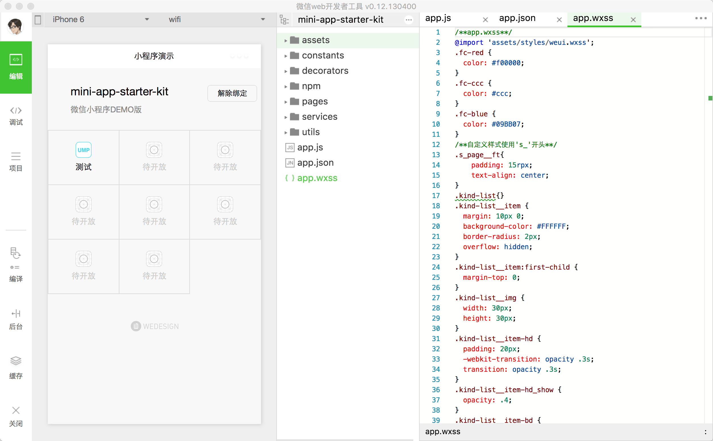

# mini-app-starter-kit

[](https://greenkeeper.io/)
基于ES6(ES7 decorator)的微信小程序DEMO

## 预览


## 特点
- 支持ES6方式开发
- ES7 装饰器引入
- 支持promise
- 支持npm包
- 引入广播机制,方便请求等异常统一处理.

## 目录介绍
```
# tree -a -L 2
.
├── .babelrc -------------------babel配置目录
├── build ----------------------构建目录
├── .editorconfig --------------editorconfig配置目录
├── .gitignore -----------------git ignore文件
├── gulpfile.babel.js ----------gulp构建脚本
├── Makefile  ------------------Makefile
├── node_modules ---------------npm包安装目录
├── npm-mapping.json -----------npm包映射配置文件
├── package.json ---------------npm配置目录
├── README.md ------------------readme
└── src ------------------------开发目录
    ├── app.js -----------------程序入口文件
    ├── app.json----------------入口配置
    ├── app.wxss----------------入口样式
    ├── assets------------------依赖资源
    ├── constants---------------常量配置
    ├── decorators--------------装饰器目录
    ├── pages-------------------页面目录
    ├── services----------------后端服务目录
    └── utils-------------------工具目录
```

## 开发
1. 依赖安装
```
# mac/linux环境下
make pre-build

# windows vagrant box linux 下
make win-pre-buid
```

2. 项目构建
```
make build
```

3. 热编译开发
```
npm run dev
```

4. 小程序预览
小程序客户端选择当前`build`目录作为源码目录，*注意为了还原真实效果，请关闭客户端ES6转码*

## Windows环境开发时注意事项
1. 在windows host中的vagrant box linux中使用npm install时，由于host os不支持linux的symbol link，所以必须使用：`npm install --no-bin-links`命令

## 如何解决npm包使用问题
小程序的引入机制不同于npm，所以当使用npm包时，要引入绝对地址，例如：`../node_modules/test/test.js`.
在开发时，一旦引入了node_modules目录下的js文件，需要相应的在`npm-mapping.json`目录下进行相关的配置。例如：
```
[
    {
        "src": "node_modules/test/index.js", // 资源地址
        "dest": "build/npm/test" // 编译后地址
    }
]
```

注意：

- **在构建时，构建工具会自动识别相应的代码，并替换成相对应的地址**
- **node_modules目录下的js文件在构建后，统一放置在`build/npm`目录下**

## 小程序暂时存在的问题
- 页面绑定的事件方法，**只能通过属性的方式去绑定**；但是这带来潜在的问题：`this.setData`等原生方法，会出现undefined的情况:
```javascript
new class A {

    constructor() {
        Page(this);
    }

    tapname = () => {
        this.setData(....)
    }
}
```

解决方式：
> 在onLoad方法里将this赋值给A的静态变量.

- redirectTo url相对路径问题，通过内部封装的方法动态计算要跳转的目标路径相对于当前路径的地址。

- wx.request同时只能发起10个请求。在搜索时，由于用户输入过快，可能存在同时进行超过10个请求的情况。

- wx.navigateBack 因delta过大造成的潜在appSdk BUG。**由于这个bug不能每次都触发，暂时判定为小程序bug**

## TODO
* 引入DI，用于管理services，避免每次对service的new操作。一定程度上避免内存泄漏。
* 程序包瘦身
